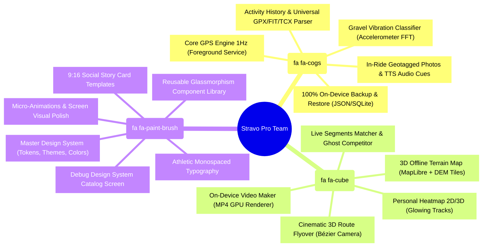
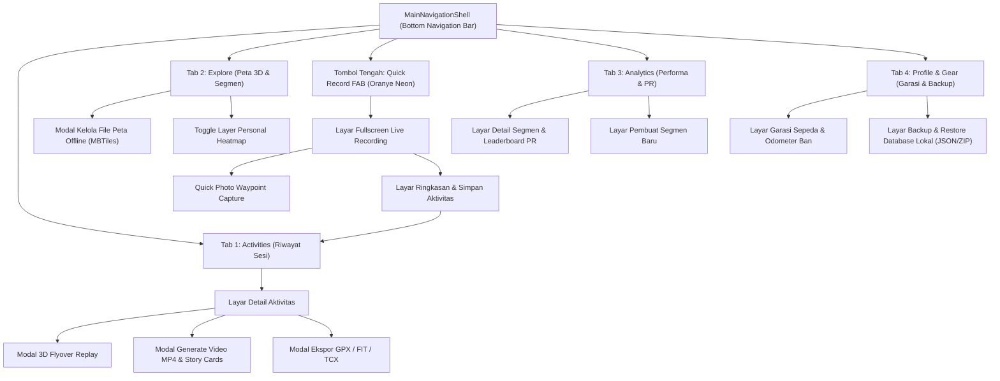
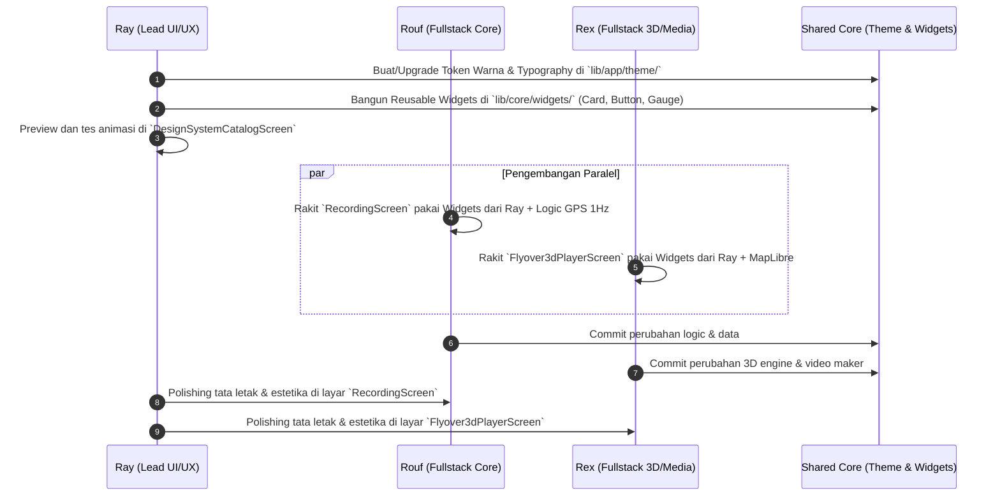

# Stravo Pro — Cetak Biru Lengkap Tim 3 Orang & Panduan Visual Aplikasi
### Panduan Kolaborasi: Rouf (Fullstack), Rex (Fullstack), dan Ray (Lead UI/UX Designer)
**100% Standalone On-Device • Zero-Server • Kedaulatan Data Penuh di HP Masing-Masing**

---

## 1. Komposisi Tim & Pembagian Tugas (Siapa Mengerjakan Apa?)

Pengembangan dibagi secara terstruktur agar **Rouf**, **Rex**, dan **Ray** dapat bekerja secepat kilat secara mandiri tanpa saling menunggu dan tanpa merusak kode satu sama lain:

```
                                  STRAVO PRO TEAM
                                         │
        ┌────────────────────────────────┼────────────────────────────────┐
        ▼                                ▼                                ▼
  [ ROUF - Fullstack ]             [ REX - Fullstack ]            [ RAY - Lead UI/UX ]
"Core Engine, Analytics,       "3D Maps, Footage Video,        "Design System, Themes,
 Media & Offline Backup"         Segments & Heatmap"             Widgets & Screen Polish"
```



---

## 2. Arsitektur Navigasi Aplikasi (Ada Berapa Navigasi?)

Aplikasi menggunakan sistem navigasi modern **4 Tab Utama + 1 Center Quick Action + Modal Sheets**:



---

## 3. Katalog Halaman Lengkap (Ada Berapa Halaman?)

Total terdapat **12 Halaman Utama (Screens)** dan **4 Lembar Aksi (Bottom Sheets)**:

| No | Nama Halaman (`Screen`) | Fungsi Utama | Penanggung Jawab |
| :--- | :--- | :--- | :--- |
| **1** | `MainNavigationShell` | Kerangka navigasi bawah (4 tab + 1 floating action button) | **Ray** |
| **2** | `ActivityHistoryScreen` (Tab 1) | List riwayat olahraga dengan mini route preview, filter jenis olahraga | **Rouf** + **Ray** |
| **3** | `ExploreMapScreen` (Tab 2) | Peta offline 3D MapLibre, tombol unduh peta, layer heatmap, filter segmen | **Rex** + **Ray** |
| **4** | `AnalyticsDashboardScreen` (Tab 3) | Statistik mingguan/bulanan, trophy Personal Records (PR), chart tanjakan | **Rex** + **Ray** |
| **5** | `ProfileAndGearScreen` (Tab 4) | Profil atlet, garasi sepeda (odometer ban), ekspor backup database lokal | **Rouf** + **Ray** |
| **6** | `RecordingScreen` (Fullscreen) | Layar utama saat berolahraga: speedometer besar neon, live map, HUD getaran | **Rouf** + **Ray** |
| **7** | `ActivitySaveSummaryScreen` | Ringkasan pasca-stop: input judul, deskripsi, thumbnail, tag gear | **Rouf** + **Ray** |
| **8** | `ActivityDetailScreen` | Analisis penuh: profil elevasi interaktif, tabel split km, galeri foto | **Rouf** + **Ray** |
| **9** | `Flyover3dPlayerScreen` (Fullscreen) | Pemutar 3D flyover sinematik dengan floating HUD telemetri dan scrubber | **Rex** + **Ray** |
| **10** | `CreateSegmentScreen` | Alat seleksi pemotong rute GPS untuk membuat segmen tantangan baru | **Rex** + **Ray** |
| **11** | `SegmentDetailScreen` | Detail profil tanjakan segmen, rekor waktu terbaik (PR), dan catatan usaha | **Rex** + **Ray** |
| **12** | `DesignSystemCatalogScreen` (Debug) | Galeri preview seluruh komponen UI (tombol, card, gauge) khusus untuk Ray | **Ray** |
| *-* | *FootageGeneratorSheet* | Pilihan template video MP4 & generator kartu Instagram Stories 9:16 | **Rex** + **Ray** |
| *-* | *QuickPhotoCaptureSheet* | Jepret foto bergeotag instan saat bersepeda/lari tanpa menutup speedometer | **Rouf** + **Ray** |
| *-* | *OfflineMapManagerSheet* | Katalog dan status file MBTiles / DEM di memori internal HP | **Rex** + **Ray** |
| *-* | *ExportBackupSheet* | Lembar ekspor/impor GPX, TCX, FIT, dan file full backup JSON | **Rouf** + **Ray** |

---

## 4. Rincian Fitur Lengkap (Ada Berapa Fitur?)

Stravo Pro memiliki **25 Fitur Lengkap** yang terbagi dalam 3 pilar:

### Pilar A: Core Tracking, Gravel Analytics & Offline Data (Rouf)
1. **1Hz GNSS Satellite Tracking**: Perekaman koordinat satelit hardware murni tanpa butuh sinyal seluler atau internet.
2. **Kalman Filter Smoothing**: Menghilangkan efek lonjakan koordinat GPS zig-zag di antara gedung atau pepohonan lebat.
3. **Smart Auto-Pause**: Otomatis menghentikan timer saat lampu merah atau istirahat, dan lanjut otomatis saat bergerak.
4. **Android Foreground Service & Wakelock**: Menjamin pelacakan tidak mati saat layar HP dikunci atau masuk ke kantong jersey.
5. **Crash-Proof Incremental SQLite Flush**: Commit data tiap 5 detik ke SQLite lokal (0% kehilangan data bila HP mati mendadak).
6. **Multi-Sport Engine**: Pilihan mode Gravel Cycling, Road Cycling, Mountain Biking, Road Run, Trail Run, dan Hiking.
7. **Accelerometer Surface Classifier**: Analisis getaran accelerometer untuk membedakan Aspal Mulus, Gravel Halus, dan Makadam Kasar.
8. **Grade Adjusted Pace (GAP) & Climb Gradient**: Kalkulasi kemiringan tanjakan instan dan penyesuaian pace lari.
9. **In-Ride Geotagged Camera**: Foto langsung tersemat koordinat GPS dan kilometer tempuh.
10. **Local TTS Audio Cues**: Suara pemberitahuan split kilometer dan peringatan pace langsung dari speaker HP secara offline.
11. **100% On-Device Backup & Restore**: Ekspor seluruh database SQLite ke berkas JSON/ZIP lokal di HP pengguna.
12. **Universal GPS File Exporter/Importer**: Ekspor dan impor format GPX, FIT, dan TCX standar dunia.

### Pilar B: Peta 3D, Video Footage, Segmen & Heatmap (Rex)
13. **Offline 3D Vector & DEM Maps**: Peta vektor topografi dengan kontur elevasi gunung nyata dari file MBTiles lokal.
14. **Color-Coded Dynamic Polylines**: Garis rute berwarna berdasarkan Kecepatan (Speed Heat), Elevasi, atau Jenis Permukaan Jalan.
15. **Cinematic 3D Route Flyover Replay**: Kamera terbang otomatis menelusuri rute dari Start ke Finish dengan kurva Bézier halus.
16. **Interactive Telemetry HUD**: Kotak overlay transparan kecepatan, ketinggian, dan jarak yang sinkron dengan kamera 3D.
17. **On-Device MP4 Video Generator**: Render video animasi rute 30 detik langsung di HP via GPU ponsel tanpa server cloud.
18. **9:16 Social Story Cards**: Generator kartu visual estetik untuk Instagram Stories, WhatsApp Status, dan TikTok.
19. **Live Segments & Spatial Matcher**: Otomatis mendeteksi saat pengguna melewati titik awal segmen buatan sendiri di jalan.
20. **Offline Ghost Pacer**: Animasi perbandingan waktu real-time melawan waktu terbaik pribadi (PR) pengguna di segmen tersebut.
21. **Personal Heatmap 2D & 3D**: Menggabungkan seluruh jalur rute pengguna di HP menjadi layer bercahaya neon.
22. **Personal Records (PR) & Volume Dashboard**: Peringkat waktu tercepat, jarak terjauh, dan akumulasi kilometer mingguan/bulanan.

### Pilar C: Master Design System & Visual Excellence (Ray)
23. **Stealth Dark & Neon Theme Engine**: Palet warna kontras tinggi yang ramah layar OLED dan mudah dibaca di bawah terik matahari.
24. **Athletic Monospaced Typography**: Angka-angka telemetri tidak bergeser horizontal saat berganti detik atau kecepatan.
25. **Glassmorphism Component Library**: Kartu metrik, tombol aksi neon glow, dan micro-animations halus yang membuat aplikasi terasa mewah.

---

## 5. Garis Besar Tampilan & Visual Wireframe

### 5.1 Filosofi Desain: *Stealth Athletic Neon*
- **Latar Belakang**: Hitam OLED pekat (`#0A0C10`) untuk menghemat baterai HP saat layar menyala di setang sepeda.
- **Kartu Informasi**: Glassmorphism semi-transparan (`#141820` dengan opacity 85% dan blur halus) dibingkai garis tepi tipis `1px rgba(255,255,255,0.08)`.
- **Aksen Warna Utama**:
  - **Stravo Orange (`#FF5500`)**: Tombol aksi utama, tanjakan terjal, tombol rekam.
  - **Cyber Gravel Green (`#00FF9D`)**: Status GPS locked, permukaan gravel, pace cepat.
  - **Electric Cyan (`#00E5FF`)**: Indikator segmen, ghost pacer ahead, jalur elevasi.
  - **Neon Red / Crimson (`#FF0055`)**: Tombol stop/selesai, tanjakan ekstrem > 13%.

---

### 5.2 Wireframe Layar 1: `RecordingScreen` (Layar Fullscreen Saat Tracking)

```text
┌────────────────────────────────────────────────────────┐
│ [● GPS LOCKED]        [100% OFFLINE]         [BAT: 92%]│
│                                                        │
│                    32.4                                │
│                   KM / H                               │
│            [▲ GRAVEL HALUS +5.4%]                      │
│────────────────────────────────────────────────────────│
│  DISTANCE       ELAPSED TIME       ELEVATION GAIN      │
│  24.85 km         01:02:18             480 m           │
│                                                        │
│  AVG SPEED         AVG PACE             VAM            │
│  24.0 km/h        02:30 /km          720 m/h           │
│────────────────────────────────────────────────────────│
│   PETA LIVE RUTE (MINI MAP / FULLSCREEN MAP TOGGLE)    │
│   ┌────────────────────────────────────────────────┐   │
│   │  [Garut -> Kamojang]                           │   │
│   │  Garis rute neon berwarna berdasarkan tanjakan │   │
│   │  📍 Foto Waypoint KM 14                        │   │
│   └────────────────────────────────────────────────┘   │
│────────────────────────────────────────────────────────│
│  [ 📷 FOTO ]        [ ⏸ PAUSE ]          [ ⏹ SELESAI ] │
└────────────────────────────────────────────────────────┘
```

---

### 5.3 Wireframe Layar 2: `ActivityDetailScreen` (Pasca Olahraga)

```text
┌────────────────────────────────────────────────────────┐
│ < KEMBALI           GRAVEL LOOP KAMOJANG        [BAGIKAN]│
│ Minggu, 11 September 2026 • Gravel Bike                │
│────────────────────────────────────────────────────────│
│ ┌────────────────────────────────────────────────────┐ │
│ │          PETA 3D TERRAIN DENGAN ELEVASI            │ │
│ │                                                    │ │
│ │       [ ▶ PUTAR 3D FLYOVER REPLAY (SINEMATIK) ]    │ │
│ └────────────────────────────────────────────────────┘ │
│────────────────────────────────────────────────────────│
│    52.4 km        02:15:30        1.150 m     56.8 km/h│
│     Jarak          Waktu          Elevasi     Top Speed│
│────────────────────────────────────────────────────────│
│ KOMPOSISI PERMUKAAN JALAN:                             │
│ [████████████████░░░░░░░░░░] 64% Gravel • 36% Aspal    │
│────────────────────────────────────────────────────────│
│ GRAFIK ELEVASI & KECEPATAN (Bisa digeser dengan jari)  │
│    /\  /\_                                             │
│ __/  \/   \__/\_________________ Profil Ketinggian     │
│────────────────────────────────────────────────────────│
│ FOTO WAYPOINT DI SEPANJANG JALUR (3 Foto):             │
│ [ 🌄 Puncak KM 18 ]   [ ☕ Warung KM 32 ]  [ 🚴 Foto ] │
│────────────────────────────────────────────────────────│
│ [ 🎬 BUAT VIDEO REKAP (MP4) ]  [ 📱 INSTAGRAM STORY ]  │
└────────────────────────────────────────────────────────┘
```

---

### 5.4 Wireframe Layar 3: `ProfileAndGearScreen` (Garasi Sepeda & Backup Lokal)

```text
┌────────────────────────────────────────────────────────┐
│ PENGATURAN & PROFIL                                    │
│ Muhammad Rouf • Atlet Gravel & Road                    │
│────────────────────────────────────────────────────────│
│ TOTAL STATISTIK SEUMUR HIDUP (100% LOKAL DI HP):       │
│   3.480 km             148 Jam            42.500 m     │
│  Total Jarak         Total Waktu        Total Elevasi  │
│────────────────────────────────────────────────────────│
│ GARASI SEPEDA (GEAR TRACKER):                          │
│ 🚲 Polygon Bend R5 (Gravel)      - 1.840 km [AKTIF]    │
│    Rantai: 1.840 km / 3.000 km [██████░░░░]            │
│ 🚲 Trek Domane SL5 (Road Bike)   - 1.640 km            │
│────────────────────────────────────────────────────────│
│ KEDAULATAN DATA (DATA SOVEREIGNTY):                    │
│ [ 💾 BACKUP SELURUH DATA KE HP (ZIP/JSON) ]            │
│ [ 📂 RESTORE / PULIHKAN DATA DARI BERKAS ]             │
│ [ 📥 IMPOR FILE GPX / FIT DARI GARMIN ]                │
└────────────────────────────────────────────────────────┘
```

---

## 6. Protokol Kolaborasi Tim 3 Orang (Agar Tidak Tabrakan)



### Aturan Emas untuk Masing-Masing Personil:

#### 1. Aturan untuk Ray (Lead UI/UX):
- **Tempat Berkarya**: `lib/app/theme/` (Warna, Font, Shadows), `lib/core/widgets/` (Tombol, Card, Speedometer, Dialog), dan `lib/features/debug/` (Design System Catalog Screen).
- **Prinsip "Dumb Component"**: Komponen di `lib/core/widgets/` tidak boleh memanggil database atau stream GPS langsung. Komponen hanya menerima input seperti `value`, `label`, `color`, dan callback `onPressed`.
- **Mempercantik Layar Teman**: Saat mempercantik `recording_screen.dart` (milik Rouf) atau `flyover_player.dart` (milik Rex), Ray hanya mengubah tata letak layout (`Padding`, `Column`, `Row`, `GlassmorphismContainer`) dan **TIDAK mengubah logic controller atau Riverpod provider**.

#### 2. Aturan untuk Rouf (Fullstack Core & Data):
- **Tempat Berkarya**: `lib/features/recording/`, `lib/features/gravel_analytics/`, `lib/features/activity_history/`, dan `lib/core/backup/`.
- **Tanggung Jawab**: Memastikan sinyal GPS 1Hz stabil, Kalman filter bekerja, auto-pause akurat, data tersimpan aman di SQLite tiap 5 detik, dan fitur backup/restore JSON berfungsi tanpa cacat.

#### 3. Aturan untuk Rex (Fullstack 3D Maps & Media):
- **Tempat Berkarya**: `lib/features/map_3d/`, `lib/features/footage_generator/`, `lib/features/segments/`, dan `lib/features/heatmap/`.
- **Tanggung Jawab**: Memastikan peta 3D offline lancar 60 FPS dari file MBTiles, kamera flyover bergerak mulus mengikuti kurva Bézier, generator MP4 merender video di HP, dan deteksi segmen offline bekerja instan.

---

### Status Kesepakatan Tim:
* Dokumen ini menjadi pedoman bersama antara **Rouf**, **Rex**, dan **Ray**.
* Setiap kode baru yang dibuat harus mengacu pada token warna, hierarki navigasi, dan kontrak arsitektur pada dokumen ini.
