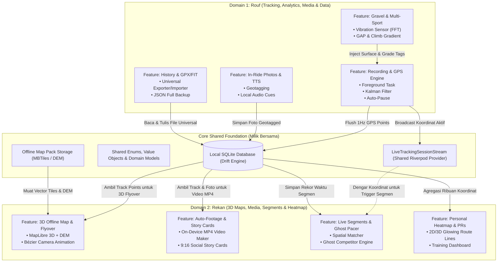
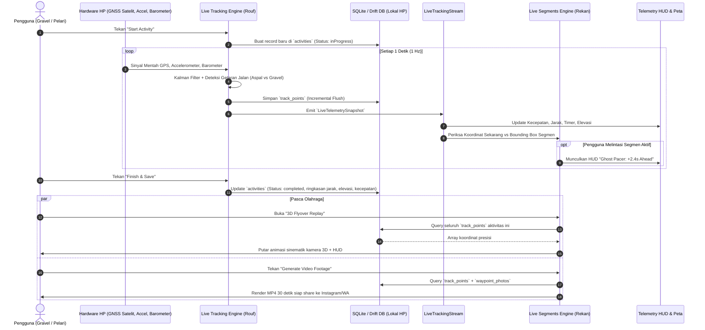
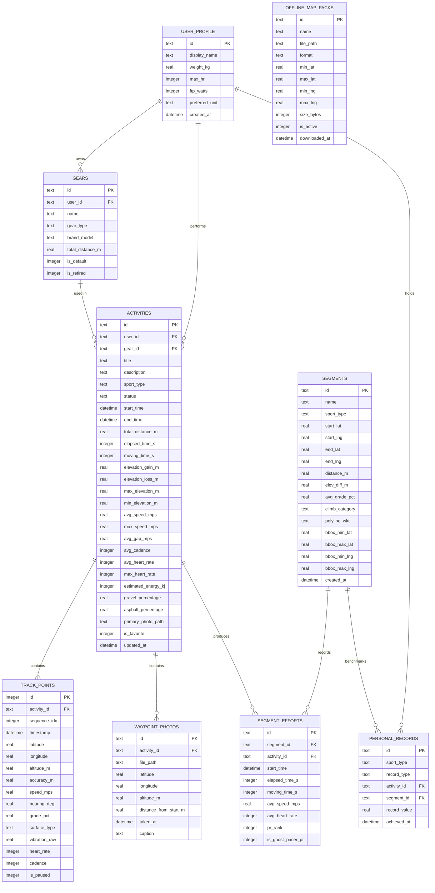
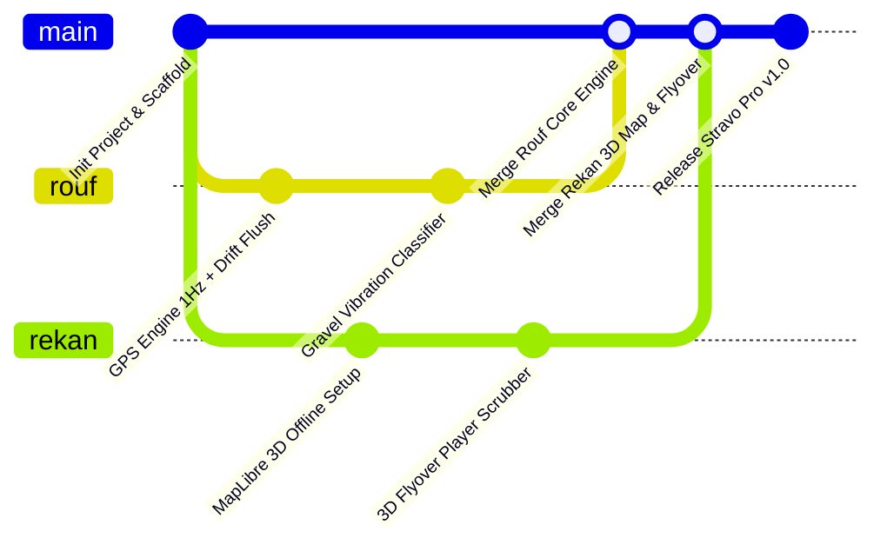

# Stravo Pro — Dokumen Kontrak Tim & Master Skema Database
### Panduan Kolaborasi 2 Developer (Fullstack Per Fitur) & Spesifikasi Database 100% Offline

**Platform:** Android / Flutter  
**Arsitektur:** 100% Standalone On-Device (Zero-Server, Pure Edge Computing)  
**Database Engine:** Drift (Type-safe SQLite untuk Dart & Flutter)  
**State Management & DI:** Riverpod 2.x (Code Generation / NotifierProvider)  
**Versi Dokumen:** 1.0 (Master Collaboration Contract)

---

## DAFTAR ISI
1. [Prinsip Kolaborasi & Pembagian Kerja (Fullstack Per Fitur)](#1-prinsip-kolaborasi--pembagian-kerja-fullstack-per-fitur)
2. [Matriks Pembagian Fitur (Rouf vs Rekan)](#2-matriks-pembagian-fitur-rouf-vs-rekan)
3. [Arsitektur Sistem & Diagram Alur](#3-arsitektur-sistem--diagram-alur)
   - [3.1 Diagram Pembagian Modul & Kepemilikan](#31-diagram-pembagian-modul--kepemilikan)
   - [3.2 Diagram Alur Data Realtime (Sensor ke Database ke Presentasi)](#32-diagram-alur-data-realtime-sensor-ke-database-ke-presentasi)
4. [Master Skema Database (Drift / SQLite Lokal)](#4-master-skema-database-drift--sqlite-lokal)
   - [4.1 Entity Relationship Diagram (ERD Mermaid)](#41-entity-relationship-diagram-erd-mermaid)
   - [4.2 Spesifikasi Detail Tabel Database](#42-spesifikasi-detail-tabel-database)
   - [4.3 Strategi Indexing untuk Performa Ekstrem (Tanpa Lag)](#43-strategi-indexing-untuk-performa-ekstrem-tanpa-lag)
5. [Shared Contracts (Tipe Data Bersama & Model Domain)](#5-shared-contracts-tipe-data-bersama--model-domain)
   - [5.1 Shared Enums](#51-shared-enums)
   - [5.2 Live Tracking Stream Contract](#52-live-tracking-stream-contract)
6. [Aturan Main Kolaborasi & Migrasi Database](#6-aturan-main-kolaborasi--migrasi-database)
   - [6.1 Protokol Migrasi Skema Drift](#61-protokol-migrasi-skema-drift)
   - [6.2 Git Branching & Workflow](#62-git-branching--workflow)
   - [6.3 Mocking Data untuk Pengembangan Independen](#63-mocking-data-untuk-pengembangan-independen)

---

# 1. Prinsip Kolaborasi & Pembagian Kerja (Fullstack Per Fitur)

Alih-alih membagi pekerjaan berdasarkan *horizontal layer* (misal: satu orang frontend, satu orang backend lokal), pengembangan Stravo Pro dibagi secara **Vertikal (Fullstack Per Fitur)**.

### Keuntungan Pembagian Vertikal:
1. **Kepemilikan Penuh (End-to-End Ownership)**: Setiap developer bertanggung jawab atas fitur yang dipegangnya mulai dari UI (Widget, Screens), State/Logic (Notifier, UseCases), hingga Database (DAO, Query, Repositori).
2. **Minim Hambatan (Zero Blocker)**: Masing-masing developer bisa membuat fitur lengkap dan langsung mengujinya tanpa harus menunggu rekannya membuatkan UI atau API/DAO.
3. **Kode Terisolasi (Minimal Git Conflicts)**: Kode fitur berada di direktori fiturnya masing-masing (`lib/features/<nama_fitur>/`). Titik temu utama hanya pada **Core Database Schema** dan **Shared Contract**.

---

# 2. Matriks Pembagian Fitur (Rouf vs Rekan)

Berikut pembagian 2 pilar besar yang seimbang dalam hal kompleksitas teknis, estetika UI, dan beban kerja:

```
                                  STRAVO PRO
                                      │
            ┌─────────────────────────┴─────────────────────────┐
            ▼                                                   ▼
   [ DEVELOPER 1: ROUF ]                              [ DEVELOPER 2: REKAN ]
"Core Engine, Analytics,                           "3D Maps, Footage Generator,
 Media & Data Pipeline"                              Heatmap & Live Segments"
```

| Modul / Fitur | Penanggung Jawab | Deskripsi Cakupan Fullstack |
| :--- | :--- | :--- |
| **1. Live Tracking Engine & Background Service** | **Rouf** | • UI: Layar perekaman GPS live, speedometer neon, tombol start/pause/stop.<br>• Logic: Integrasi satelit GNSS murni (1Hz), Kalman Filter, auto-pause, Android Foreground Service persisten (`PARTIAL_WAKE_LOCK`).<br>• DB: Incremental flush tiap 5s ke `activities` & `track_points` (Jaminan 0% data loss). |
| **2. Multi-Sport & Gravel Analytics** | **Rouf** | • UI: Visualisasi indikator tipe jalan (Aspal/Gravel/Makadam), grafik elevasi & tanjakan berwarna (Climb Index).<br>• Logic: Analisis sinyal getaran accelerometer (FFT/Vibration Classifier), Grade Adjusted Pace (GAP), kalkulasi estimasi watt sepeda.<br>• DB: Menyimpan tag jalan dan statistik ke tabel `track_points` & `activities`. |
| **3. In-Ride Geotagged Media & Audio Cues** | **Rouf** | • UI: Tombol cepat jepret foto saat bersepeda/lari, galeri foto aktivitas.<br>• Logic: Auto-geotagging foto dengan koordinat & kilometer ke-X, Android Local TTS (Text-to-Speech) untuk split km & peringatan suara.<br>• DB: CRUD tabel `waypoint_photos`. |
| **4. Activity History & Universal Exporter/Importer** | **Rouf** | • UI: List riwayat aktivitas, halaman detail aktivitas tabulasi (Stats & Splits).<br>• Logic: Parser & generator file GPX, TCX, FIT, serta export/import backup file JSON lokal.<br>• DB: Query riwayat aktivitas dengan filter multi-sport, tanggal, dan sorting. |
| **5. 3D Terrain Map & Cinematic Route Flyover** | **Rekan** | • UI: Widget peta 3D MapLibre offline, pemutar 3D Flyover Replay dengan Telemetry HUD overlay, scrubber, kecepatan 1x-8x.<br>• Logic: Pengendali kamera 3D Bézier interpolation, hillshading DEM lokal, dynamic color-coded polylines.<br>• DB: Membaca `track_points` dan menghubungkannya dengan paket peta offline `offline_map_packs`. |
| **6. On-Device Auto-Footage & Social Story Cards** | **Rekan** | • UI: Lembar ekspor media sosial, pemilih template kartu (Dark Neon, Topo Gravel, Minimalist), dialog progres render video.<br>• Logic: Render animasi rute langsung di GPU ponsel (Skia Canvas + `ffmpeg_kit_flutter`), pop-up foto waypoint di video.<br>• DB: Query metadata aktivitas, titik rute, dan foto untuk disatukan jadi video MP4/gambar PNG. |
| **7. Live Segments & Ghost Competitor** | **Rekan** | • UI: Pembuat segmen kustom di peta, HUD Live Segment saat melintasi segmen, animasi balapan melawan Ghost Pacer.<br>• Logic: Spatial bounding box matching, perhitungan deviasi waktu real-time vs PR pengguna.<br>• DB: CRUD dan query spasial tabel `segments` dan `segment_efforts`. |
| **8. Personal Heatmap 2D/3D & Dashboard PR** | **Rekan** | • UI: Layar Personal Heatmap (jalur bercahaya dari seluruh riwayat rute), Dashboard analitik mingguan/bulanan & showcase piala PR.<br>• Logic: Agregasi ribuan titik GPS menjadi heatmap layer lokal di HP, evaluasi otomatis Personal Records.<br>• DB: Agregasi koordinat dari `track_points` dan CRUD tabel `personal_records`. |

---

# 3. Arsitektur Sistem & Diagram Alur

### 3.1 Diagram Pembagian Modul & Kepemilikan



---

### 3.2 Diagram Alur Data Realtime (Sensor ke Database ke Presentasi)



---

# 4. Master Skema Database (Drift / SQLite Lokal)

Aplikasi ini menggunakan **Drift** sebagai persistence layer. Drift menyediakan type-safety, reactive streams (`watch()`), dan performa kompilasi C SQLite native.

### 4.1 Entity Relationship Diagram (ERD Mermaid)



---

### 4.2 Spesifikasi Detail Tabel Database

#### 1. Tabel `activities` (Dikelola bersama, Utama: Rouf)
Menyimpan ringkasan setiap sesi olahraga.
- `id` (Text, Primary Key): UUID v4 (`"act_2026_09_11_abc123"`).
- `sport_type` (Text): Enum (`gravelCycling`, `roadCycling`, `mountainBiking`, `roadRunning`, `trailRunning`, `hiking`).
- `status` (Text): Enum (`inProgress`, `completed`, `discarded`).
- `start_time` & `end_time` (DateTime): Waktu mulai dan selesai.
- `total_distance_m` (Real): Total jarak dalam meter.
- `elapsed_time_s` & `moving_time_s` (Integer): Durasi total dan durasi bergerak (dikurangi auto-pause).
- `elevation_gain_m` & `elevation_loss_m` (Real): Akumulasi elevasi naik dan turun.
- `avg_speed_mps` & `max_speed_mps` (Real): Kecepatan rata-rata dan puncak (meter/detik).
- `avg_gap_mps` (Real): Grade Adjusted Pace rata-rata untuk lari/sepeda menanjak.
- `gravel_percentage` & `asphalt_percentage` (Real): Persentase permukaan jalan yang dilalui (0.0 - 100.0).

#### 2. Tabel `track_points` (Utama: Rouf, Dibaca: Rekan)
Menyimpan breadcrumb GPS setiap detik (1Hz) yang sangat vital untuk rute 3D, flyover, dan heatmap.
- `id` (Integer, Primary Key, Auto-increment): ID sekuensial lokal.
- `activity_id` (Text, Foreign Key -> `activities.id` ON DELETE CASCADE).
- `sequence_idx` (Integer): Urutan titik ke-0, 1, 2, ...
- `timestamp` (DateTime): Waktu pasti titik diambil.
- `latitude` & `longitude` (Real): Koordinat WGS84 presisi ganda (*double precision*).
- `altitude_m` (Real): Ketinggian dari barometer/GNSS.
- `accuracy_m` (Real): Estimasi radius ketidakpastian sinyal GPS.
- `speed_mps` (Real): Kecepatan instan titik tersebut.
- `grade_pct` (Real): Kemiringan tanjakan/turunan saat itu (-25% s/d +35%).
- `surface_type` (Text): Klasifikasi jalan (`asphalt`, `smoothGravel`, `roughGravel`, `dirt`).
- `is_paused` (Integer/Bool): Flag jika titik terjadi saat berhenti/auto-pause.

#### 3. Tabel `waypoint_photos` (Utama: Rouf, Dibaca: Rekan)
Foto yang diambil pengguna selama berolahraga untuk ditampilkan di peta dan video flyover.
- `id` (Text, Primary Key): UUID v4.
- `activity_id` (Text, Foreign Key -> `activities.id` ON DELETE CASCADE).
- `file_path` (Text): Alamat berkas lokal di HP (`/storage/.../photos/stravo_xxx.jpg`).
- `latitude`, `longitude`, `altitude_m` (Real): Lokasi geotag.
- `distance_from_start_m` (Real): Jarak kilometer tempuh saat foto dijepret.

#### 4. Tabel `segments` & `segment_efforts` (Utama: Rekan)
Segmen kustom ala Strava KOM/QOM versi lokal offline.
- `segments`: Menyimpan koordinat awal (`start_lat`/`start_lng`), titik akhir, jarak, elevasi, dan koordinat pembatas `bbox_min_lat`, `bbox_max_lat`, `bbox_min_lng`, `bbox_max_lng` agar pencarian saat tracking sangat cepat tanpa membebani CPU.
- `segment_efforts`: Catatan setiap kali pengguna melewati segmen tersebut beserta peringkat waktu terbaik (*PR Rank 1, 2, 3*).

#### 5. Tabel `offline_map_packs` (Utama: Rekan)
Katalog file peta vektor MBTiles / PMTiles dan DEM raster yang tersimpan di storage internal ponsel.

---

### 4.3 Strategi Indexing untuk Performa Ekstrem (Tanpa Lag)

Aplikasi tracking mengumpulkan 3.600 s/d 18.000 titik GPS dalam 1 sesi (1 s/d 5 jam). Agar query 3D Map, Replay, dan Heatmap tetap instan 60 FPS, index berikut **wajib diaktifkan di Drift**:

```sql
-- 1. Index gabungan untuk query rute aktivitas tertentu secara urut
CREATE INDEX idx_trackpoints_activity_seq 
ON track_points (activity_id, sequence_idx ASC);

-- 2. Index spasial bounding box untuk Live Segment matcher kilat
CREATE INDEX idx_segments_bbox 
ON segments (bbox_min_lat, bbox_max_lat, bbox_min_lng, bbox_max_lng);

-- 3. Index untuk agregasi Personal Heatmap berdasarkan jenis olahraga
CREATE INDEX idx_activities_sport_status 
ON activities (sport_type, status);

-- 4. Index waktu segmen effort
CREATE INDEX idx_segment_efforts_lookup 
ON segment_efforts (segment_id, elapsed_time_s ASC);
```

---

# 5. Shared Contracts (Tipe Data Bersama & Model Domain)

Agar kode Rouf dan Rekan bisa langsung terhubung tanpa saling menunggu, berikut adalah kontrak tipe data bersama yang disepakati:

### 5.1 Shared Enums (`lib/core/constants/enums.dart`)

```dart
/// Jenis olahraga yang didukung Stravo Pro
enum SportType {
  gravelCycling,
  roadCycling,
  mountainBiking,
  roadRunning,
  trailRunning,
  hiking,
  walking;

  String get displayName {
    switch (this) {
      case SportType.gravelCycling: return 'Gravel Ride';
      case SportType.roadCycling: return 'Road Cycling';
      case SportType.mountainBiking: return 'Mountain Bike (MTB)';
      case SportType.roadRunning: return 'Road Run';
      case SportType.trailRunning: return 'Trail Run';
      case SportType.hiking: return 'Hike';
      case SportType.walking: return 'Walk';
    }
  }

  bool get isCycling => this == gravelCycling || this == roadCycling || this == mountainBiking;
  bool get isRunning => this == roadRunning || this == trailRunning;
}

/// Klasifikasi getaran permukaan jalan (Deteksi Accelerometer)
enum SurfaceType {
  asphalt,
  smoothGravel,
  roughGravel,
  dirt,
  cobblestone,
  unknown;

  String get label {
    switch (this) {
      case SurfaceType.asphalt: return 'Aspal Mulus';
      case SurfaceType.smoothGravel: return 'Gravel Halus';
      case SurfaceType.roughGravel: return 'Gravel Kasar / Makadam';
      case SurfaceType.dirt: return 'Tanah / Trail';
      case SurfaceType.cobblestone: return 'Batu Bata / Paving';
      case SurfaceType.unknown: return 'Tidak Teridentifikasi';
    }
  }
}

/// Kategori Tanjakan (Climb Gradient Index)
enum ClimbCategory {
  flat,   // < 3%
  cat4,   // 3% - 5%
  cat3,   // 5% - 8%
  cat2,   // 8% - 11%
  cat1,   // 11% - 15%
  hc;     // Hors Catégorie (> 15% atau panjang ekstrem)
}

/// Status Sesi Aktivitas
enum ActivityTrackingStatus {
  idle,
  recording,
  paused,
  stopped;
}
```

### 5.2 Live Tracking Stream Contract (`lib/core/location/models/telemetry_snapshot.dart`)

Rouf memproduksi stream ini setiap 1 detik. Rekan dapat langsung memakainya di fitur **Live Segments** dan **Live Map**:

```dart
class LiveTelemetrySnapshot {
  final double currentSpeedKmh;
  final double averageSpeedKmh;
  final double totalDistanceMeters;
  final int movingTimeSeconds;
  final double currentAltitudeMeters;
  final double totalElevationGainMeters;
  final double currentGradePct;
  final SurfaceType currentSurface;
  final double latitude;
  final double longitude;
  final DateTime timestamp;
  final bool isAutoPaused;

  const LiveTelemetrySnapshot({
    required this.currentSpeedKmh,
    required this.averageSpeedKmh,
    required this.totalDistanceMeters,
    required this.movingTimeSeconds,
    required this.currentAltitudeMeters,
    required this.totalElevationGainMeters,
    required this.currentGradePct,
    required this.currentSurface,
    required this.latitude,
    required this.longitude,
    required this.timestamp,
    required this.isAutoPaused,
  });
}
```

---

# 6. Aturan Main Kolaborasi & Migrasi Database

### 6.1 Protokol Migrasi Skema Drift (Sangat Krusial!)

Agar perubahan database tidak merusak database di HP teman:
1. **Central Schema File**: File definisi tabel berada di `lib/core/database/tables/`.
2. **Aturan Penambahan Kolom / Tabel**:
   - Jika Rouf atau Rekan ingin menambah tabel atau kolom baru, diskusikan dulu lewat commit message atau chat.
   - Naikkan `schemaVersion` di `AppDatabase` (misal dari `1` ke `2`).
   - Tulis fungsi migrasi di `MigrationStrategy` menggunakan `m.createTable()` atau `m.addColumn()`. Jangan pernah melakukan `schemaVersion` upgrade tanpa menulis blok migrasi, agar data yang sudah direkam saat testing tidak terhapus.
3. **Build Runner Generation**:
   - Jalankan `dart run build_runner build --delete-conflicting-outputs` setiap kali mengubah struktur tabel Drift.
   - Jangan melakukan commit file `.g.dart` yang sedang *conflict*. Jalankan re-generate ulang di lokal masing-masing.

### 6.2 Git Branching & Workflow

Gunakan alur git yang bersih dan rapi:
- `main`: Branch stabil, siap rilis/install di HP untuk dipakai sepedaan/lari.
- `rouf`: Branch kerja Rouf (Core engine, recording, analytics, media).
- `rekan`: Branch kerja Rekan (3D maps, footage generator, segments, heatmap).
- Format commit:
  - `feat(recording): implement kalman filter on gps stream`
  - `feat(map3d): integrate maplibre offline mbtiles terrain`
  - `feat(database): add segment_efforts table with migration v2`



### 6.3 Mocking Data untuk Pengembangan Independen

Rekan tidak perlu menunggu Rouf selesai sepedaan di luar rumah untuk menguji fitur 3D Flyover atau Video Generator:
- Telah disediakan aset dummy rute GPX di folder `assets/mock_routes/` (misal: rute gravel 25 km dengan tanjakan dan foto sampel).
- Rekan dapat memanggil `MockRouteProvider.loadSampleActivity()` untuk langsung mengisi database lokal dengan 5.000 titik GPS dan menguji animasi 3D, live segment, atau render video di emulator/HP tanpa harus bergerak.

---

### Siap Diimplementasikan!
Dokumen ini mengikat kesepakatan teknis antara Rouf dan Rekan. Seluruh kode yang ditulis ke depan wajib mengacu pada skema tabel, tipe enum, dan kontrak interface yang telah diresmikan di sini.
