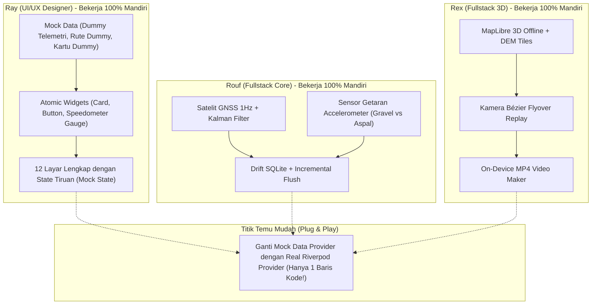

# Panduan Kerja Serentak 100% Tanpa Saling Menunggu
### Bagaimana Rouf, Rex, dan Ray Bisa Bekerja Bersama-sama Sejak Hari Pertama

Dokumen ini menjelaskan strategi teknis agar **Ray (Lead UI/UX)** bisa merancang dan menyelesaikan **100% tampilan seluruh 12 layar aplikasi** tanpa perlu menunggu sensor GPS, database SQLite dari Rouf, atau peta 3D dari Rex selesai.

Begitu pula **Rouf** dan **Rex** dapat mengembangkan *logic*, algoritma, dan *database* secara murni tanpa perlu menunggu desain UI selesai.

---

## 1. Rahasia Kerja Independen: Pola "Mock-Driven Development"

Dalam rekayasa perangkat lunak modern, kita memisahkan antara **Tampilan (Presentational UI)** dan **Data Sebenarnya (Real Data Source)**.



---

## 2. Cara Praktis Ray Mendesain Tanpa Menunggu

Ray tidak perlu pusing memikirkan apakah GPS di laptop/HP-nya menyala atau apakah database sudah terinstall. Ray cukup menggunakan **Mock State**:

### Contoh 1: Ray Mendesain `RecordingScreen` (Layar Speedometer GPS)
Ray membuat UI dengan angka dummy:
```dart
// Ray cukup menampilkan data tiruan ini di UI:
final mockSpeed = 32.4; // km/h
final mockDistance = 24.85; // km
final mockTime = '01:02:18';
final mockElevation = 480; // m
final mockSurface = SurfaceType.smoothGravel;
```
Ketika Rouf selesai membuat GPS engine sungguhan, Rouf hanya tinggal mengganti variabel di atas dengan stream aslinya:
```dart
// Saat Rouf selesai, tinggal disambungkan ke provider:
final telemetry = ref.watch(liveTelemetryStreamProvider).value;
```
**Hasilnya**: Desain Ray tidak rusak sama sekali, dan pekerjaan Rouf langsung tampil cantik!

---

### Contoh 2: Ray Mendesain `ActivityDetailScreen` (Riwayat Sesi)
Ray membuat UI dengan data aktivitas tiruan:
* Judul: *"Gravel Loop Kamojang 52 KM"*
* Jenis Olahraga: *Gravel Cycling*
* Jarak: *52.4 km*, Waktu: *02:15:30*, Elevasi: *1.150 m*
* Komposisi: *64% Gravel, 36% Aspal*
* Peta: Placeholder rute dummy atau polyline statis.

Ray bebas mengatur warna teks, layout tombol, efek glassmorphism, dan bayangan tanpa harus bersepeda keluar rumah untuk merekam rute sungguhan!

---

## 3. Taman Bermain Khusus Ray: `DesignSystemCatalogScreen`

Agar Ray bisa melihat semua tombol, kartu, dan speedometer sekaligus dalam satu halaman:
1. Ray membuka menu debug di aplikasi: `DesignSystemCatalogScreen`.
2. Halaman ini berisi seluruh komponen yang Ray buat:
   - Deretan warna tema (`StravoColors`)
   - Variasi kartu glassmorphism (`StravoCard`)
   - Speedometer bulat neon (`NeonSpeedometerGauge`)
   - Tombol-tombol aksi (`StravoGradientButton`)
   - Badge tanjakan dan jenis jalan (`SurfaceTypeBadge`, `ClimbGradientIndicator`)
3. Ray bisa mengubah padding, ukuran font, dan warna, lalu langsung melihat hasilnya dengan *Hot Reload* Flutter dalam 1 detik!

---

## 4. Checklist Sinergi: Kapan Harus Berkoordinasi?

| Waktu | Apa yang Harus Dilakukan? |
| :--- | :--- |
| **Awal (Hari 1-3)** | • Ray membuat Design Tokens (`colors.dart`, `typography.dart`) dan widget dasar.<br>• Rouf setup schema database Drift & GPS foreground task.<br>• Rex setup MapLibre offline & pemutar flyover dengan data GPX sampel. |
| **Pertengahan (Hari 4-10)** | • Ray merakit 12 layar lengkap dengan mock data.<br>• Rouf mengetes kalkulator getaran jalan & auto-pause.<br>• Rex mengetes video MP4 generator di GPU ponsel. |
| **Integrasi (Akhir)** | • Rouf & Rex menyambungkan Provider data nyata ke widget yang sudah selesai dibuat Ray.<br>• Ray melakukan *visual polish* terakhir di layar HP sungguhan. |

Dengan cara ini, **tidak ada satu orang pun yang menganggur atau terhambat oleh orang lain!**
